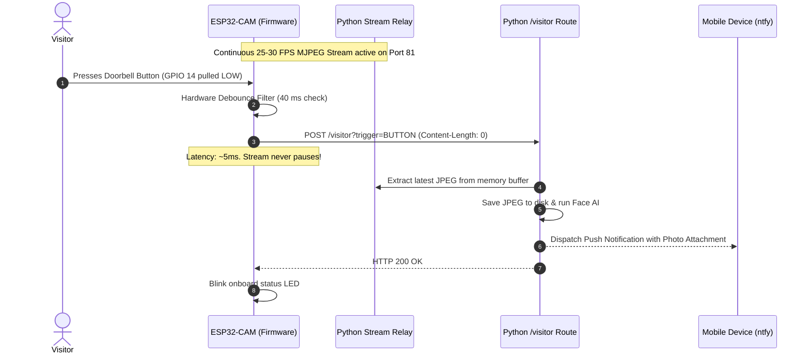
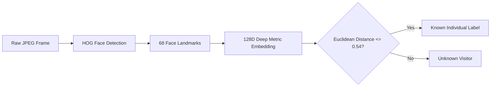
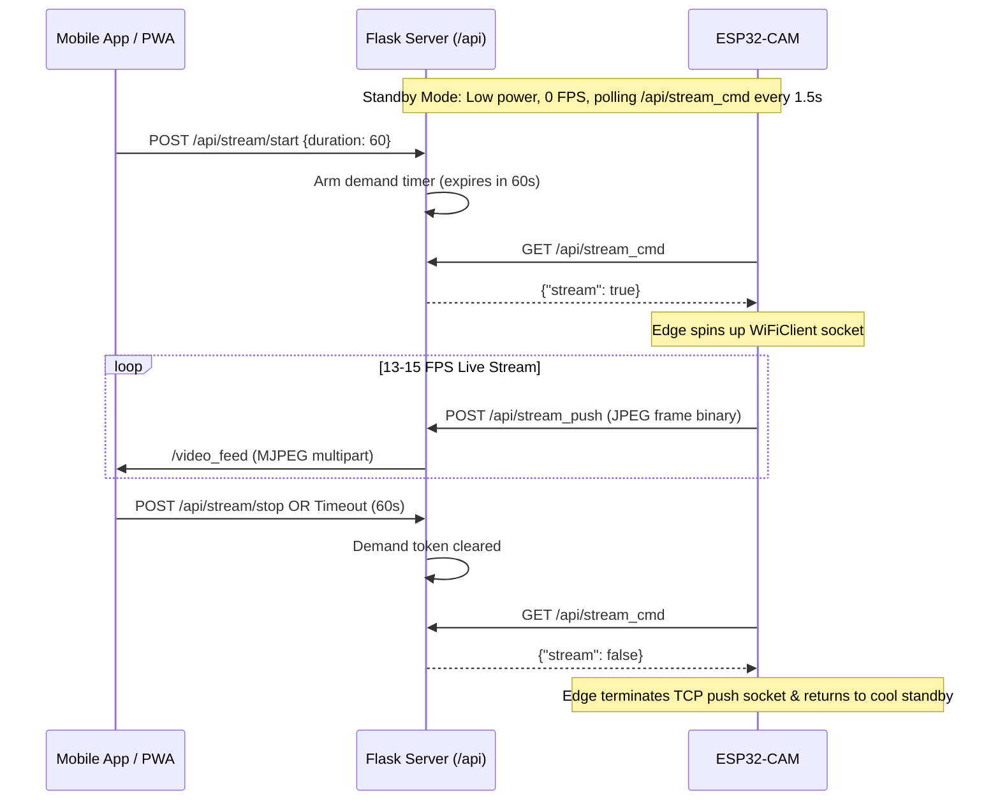
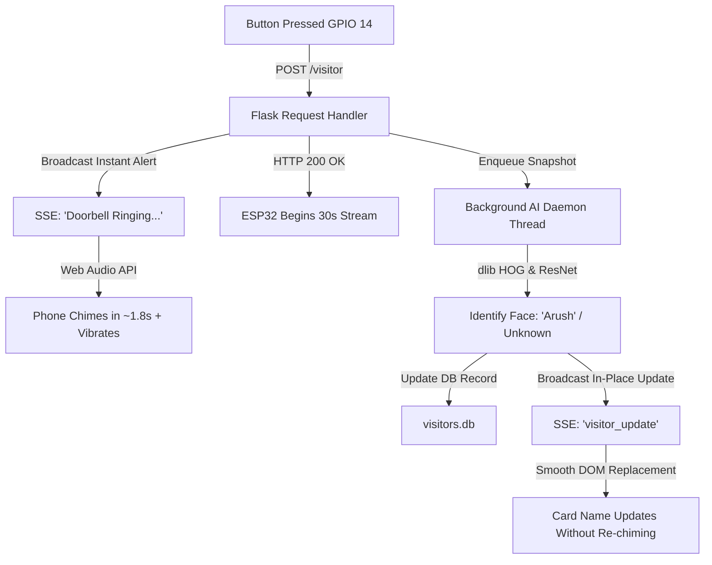

# System Architecture & Technical Deep Dive

This document details the hardware, firmware, and software engineering design decisions behind **DoorCam**, an open-source AI-powered smart video doorbell system.

---

## 1. System Block Diagram

```mermaid
graph TB
    subgraph EdgeDevice ["Edge Device: ESP32-CAM (AI Thinker + OV3660)"]
        OV[OV3660 3MP Sensor] -->|DMA / I2S Bus| CAM_BUF[2x Framebuffers in PSRAM]
        CAM_BUF -->|MJPEG Chunking| HTTP_SRV[esp_http_server Task: Port 81]
        BTN[Push Button GPIO 14] -->|Hardware Debounce| TRIG[Event Dispatcher]
        PIR[PIR HC-SR501 GPIO 13] -->|Active-High Interrupt| TRIG
        TRIG -->|HTTP POST ~5ms 0-byte| NET_OUT[WiFi Radio 2.4GHz]
    end

    subgraph HostServer ["Host Server: Python Flask Backend (Port 5000)"]
        NET_OUT -.->|HTTP POST /visitor| ROUTE_VIS[/visitor Endpoint]
        HTTP_SRV -.->|Persistent Single Socket| RELAY[CameraStreamRelay Worker Thread]
        RELAY -->|Latest Frame Buffer| RAM_BUF[(In-Memory JPEG Buffer)]
        
        ROUTE_VIS -->|Instant Snapshot Read| RAM_BUF
        ROUTE_VIS -->|Save to Disk| DISK[visitors/YYYY-MM-DD/]
        DISK -->|Image Array| FACE_AI[Face Recognition Engine: dlib / HOG]
        FACE_AI -->|Match Distance & ID| DB[(SQLite: visitors.db)]
        
        DB -->|Broadcast Visitor Event| SSE[Server-Sent Events: /api/events/stream]
        ROUTE_VIS -->|Dispatch Rich Alert| NTFY_CLIENT[ntfy.sh REST API]
    end

    subgraph Clients ["Client Ecosystem"]
        RAM_BUF -->|Deduplicated Stream| WEB_FEED[/video_feed: ~30 FPS]
        WEB_FEED --> PWA[Mobile / Desktop PWA Browser]
        SSE --> PWA
        NTFY_CLIENT --> MOBILE[Mobile Lock Screen Push Notifications]
    end
```

---

## 2. Firmware Architecture & Hardware Constraints

### A. DMA Buffer Allocation & Race Condition Avoidance
The ESP32-CAM utilizes an **OV3660 3-Megapixel CMOS sensor** communicating over a 10-line parallel interface (D0–D7, VSYNC, HREF, PCLK) using Direct Memory Access (DMA).

- **PSRAM Dual Buffering (`fb_count = 2`)**: The ESP32's 4MB external PSRAM is configured to allocate two framebuffers (`FRAMESIZE_VGA` at `640x480`).
- **Single-Consumer Guarantee**: To prevent catastrophic DMA starvation (where concurrent FreeRTOS tasks call `esp_camera_fb_get()` and exhaust buffers, locking up the I2S DMA FIFO), firmware enforces strict separation of concerns:
  - The `stream_handler` running on the `httpd` worker task is the **sole consumer** of `esp_camera_fb_get()`.
  - Doorbell push button and PIR sensor events **never** attempt camera capture on the edge device. Instead, they transmit a 0-byte trigger signal to the host server in ~5 ms.

### B. Self-Healing Camera Watchdog
Hardware sensors exposed to long jumper wires and electrical noise can experience SCCB/I2C bus drops or DMA timeouts. 
- Firmware implements consecutive-failure tracking in `stream_handler`:
  - Transient single-frame drops yield for 40 ms and retry without aborting the HTTP connection.
  - If 15 consecutive capture attempts fail, the firmware triggers an automated hardware reboot via `ESP.restart()`, bringing the camera back online within 1.5 seconds without requiring physical intervention.

---

## 3. Zero-Payload Event Triggering

Traditional IoT camera sketches attempt to capture high-resolution photos and upload multipart payloads (60–100 KB) when an event occurs. On single-radio 2.4 GHz ESP32 chips, doing this while simultaneously serving a video stream causes:
1. Wi-Fi packet drops and LwIP TCP buffer exhaustion.
2. Frame rate degradation to 0 FPS (freezing).
3. Simultaneous DMA buffer acquisition collisions.

### Zero-Payload Sequence Diagram


---

## 4. Software Backend & Stream Multiplexing

### A. CameraStreamRelay Architecture
The ESP32 `httpd` component is constrained to 4 concurrent sockets and single-threaded request handlers. Directly connecting multiple mobile phones and browser tabs to the camera locks up the device.

The Python server solves this using the **`CameraStreamRelay`** daemon:
- Maintains **exactly one** persistent HTTP connection to `http://<ESP32_IP>:81/`.
- Reads chunks from the HTTP stream, searches for JPEG boundary markers (`0xFF, 0xD8` for SOI and `0xFF, 0xD9` for EOI), and isolates complete frames into thread-safe memory.
- Protects the latest frame with a `threading.Lock()` and tracks the arrival timestamp `last_frame_time`.

### B. Frame Deduplication in `/video_feed`
Naive streaming relays yield the latest frame in a timed loop (e.g. every 40 ms). If the camera experiences a transient 100 ms Wi-Fi delay, the server sends duplicate frames, flooding client decoders.

DoorCam implements **timestamp-based frame deduplication**:
```python
last_sent_time = 0
while True:
    with camera_relay.lock:
        frame = camera_relay.latest_frame
        frame_time = camera_relay.last_frame_time
    if frame and frame_time != last_sent_time:
        last_sent_time = frame_time
        yield (b"--boundary\r\nContent-Type: image/jpeg\r\n\r\n" + frame + b"\r\n")
    time.sleep(0.01)
```
This guarantees clients receive only new, unique frames, minimizing client decode overhead and network utilization.

---

## 5. Facial Recognition Pipeline



1. **Detection**: Histogram of Oriented Gradients (HOG) algorithm identifies face bounding boxes.
2. **Alignment**: 68 facial landmarks are computed using dlib's shape predictor.
3. **Embedding**: A deep ResNet neural network maps the aligned face into a **128-dimensional hypersphere embedding**.
4. **Classification**: Vector distance between the input face embedding and the pre-computed known face database is calculated via Euclidean metric:
   $$d = \sqrt{\sum_{i=1}^{128} (x_i - y_i)^2}$$
5. **Threshold**: A calibrated distance threshold of `0.54` provides an optimal balance between false acceptance and false rejection on doorway perspectives.

---

## 6. Database Schema

DoorCam logs all visitor interactions to a lightweight SQLite database (`visitors.db`):

```sql
CREATE TABLE IF NOT EXISTS visits (
    id INTEGER PRIMARY KEY AUTOINCREMENT,
    timestamp DATETIME DEFAULT CURRENT_TIMESTAMP,
    name TEXT NOT NULL,
    photo_path TEXT NOT NULL,
    trigger_source TEXT NOT NULL,  -- 'BUTTON' or 'PIR'
    confidence REAL                -- Distance metric (lower is more confident)
);

CREATE INDEX IF NOT EXISTS idx_visits_timestamp ON visits(timestamp);
```

---

## 7. On-Demand Cloud Streaming & Bandwidth Safety Engine

To operate within cloud resource constraints (such as Render's 100 GB/month bandwidth limit) while preventing continuous heat generation on the ESP32-CAM, DoorCam employs an **on-demand signaling protocol**:



### In-Flight Frame Drain Guard
When a user clicks **Stop Stream**, delayed network frames in transit over cellular data can arrive after the client has switched to snapshot view. The client and server enforce a 4.5-second frame drain barrier that suppresses stale frames, ensuring a clean freeze-frame snapshot state.

---

## 8. Asynchronous Biometric Inference & Sub-2s Chime Pipeline

Synchronous execution of deep convolutional neural networks (`dlib` HOG detection and ResNet-34 landmark embedding) introduces a 300–600 ms compute latency. Over WAN connections, this resulted in a 6–7 second delay between a physical button press and the homeowner's smartphone chiming.

### Decoupled Worker Thread Architecture


This decoupled architecture guarantees **sub-2-second end-to-end chime alerts** while preserving 100% facial recognition accuracy.

---

## 9. Local Timezone Display & Real-Time Feed Purging

### Timezone Normalization
- Server instances (e.g. Render Linux containers running in UTC) record timestamps using `LOCAL_TIMEZONE = datetime.timezone(datetime.timedelta(hours=5, minutes=30))` (IST).
- The client-side `formatDisplayTime(rawTs)` engine automatically parses legacy UTC entries and current timestamps, formatting them cleanly as `Sep 13, 12:47:15 PM`.

### Real-Time Feed Clearing
- Triggering `POST /api/feed/clear` executes `DELETE FROM visits` on the SQLite database.
- The server broadcasts a `feed_cleared` event across the Server-Sent Events pipeline.
- All active browser tabs and mobile devices synchronously clear their DOM timelines, reset the event counter to `0 events`, and display the empty-state illustration without requiring a manual page refresh.

