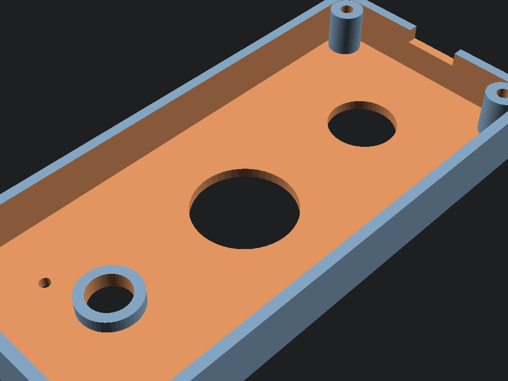
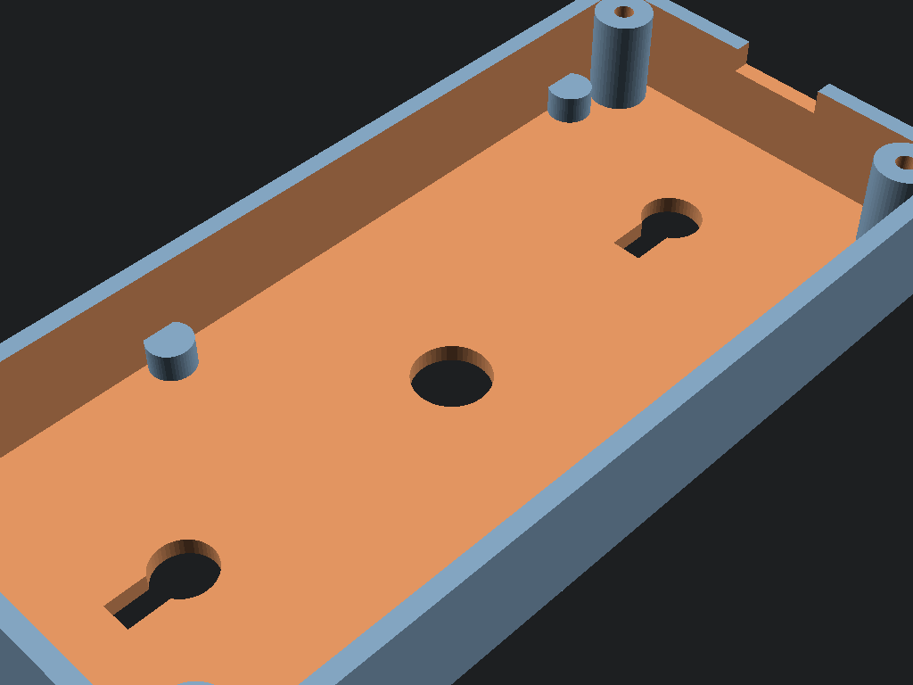
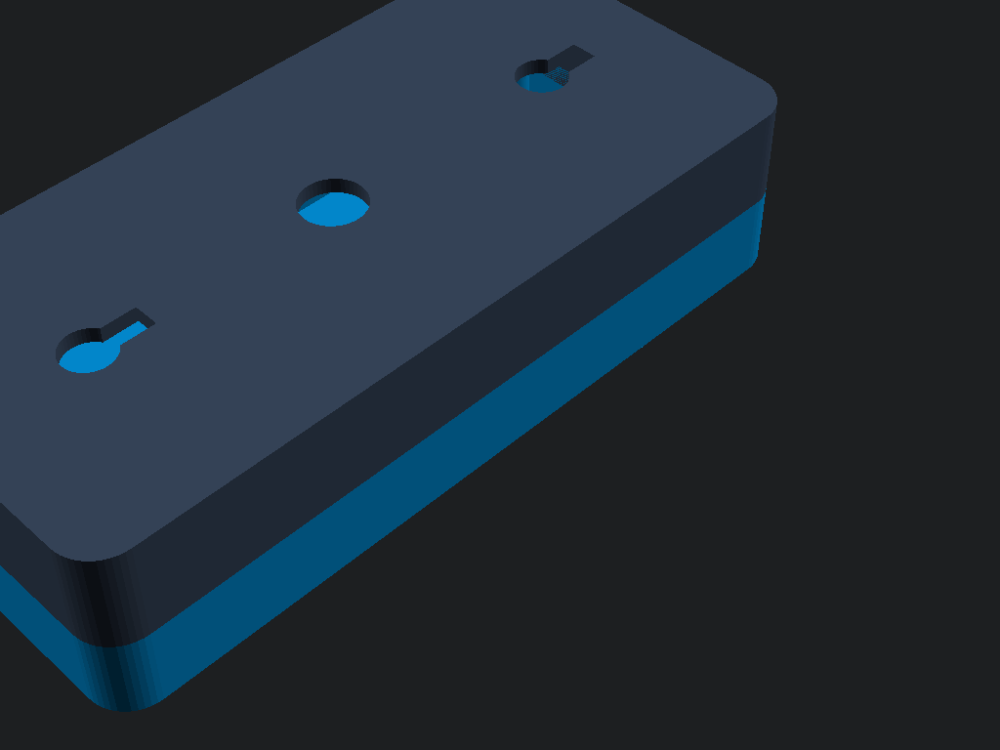

# 3D Printable DoorCam Enclosure (Robu.in Ready)

This directory contains the production-grade CAD designs, binary 3D printable `.stl` models, and visual renders for the **DoorCam Smart Doorbell Enclosure**.

Engineered specifically for the **5x7cm Double-Sided FR-4 Perfboard**, **AI-Thinker ESP32-CAM**, **HC-SR501 PIR sensor**, **16mm tactile push button**, and **Type-C 16-pin USB breakout**.

---

## 📦 Production STL Files for 3D Printing

Both files are pre-oriented flat on the build plate (`Z = 0`), watertight, manifold, and require **zero support material**:

| Part | File Link | Dimensions (mm) | Triangles | Format | Print Orientation |
| :--- | :--- | :--- | :--- | :--- | :--- |
| **Front Shell** | [`doorbell_front.stl`](doorbell_front.stl) | `58.8 x 124.8 x 13.0` | 3,808 | Binary STL | Flat face on bed |
| **Back Shell** | [`doorbell_back.stl`](doorbell_back.stl) | `58.8 x 124.8 x 15.8` | 3,104 | Binary STL | Wall face on bed |

*(ASCII versions are also preserved at [`doorbell_front_ascii.stl`](doorbell_front_ascii.stl) and [`doorbell_back_ascii.stl`](doorbell_back_ascii.stl) for text inspection).*

---

## 🎨 Visual 3D Renders

| Front Shell Interior | Back Wall Mount Interior | Full Assembled Unit |
| :---: | :---: | :---: |
|  |  |  |

---

## 📐 Enclosure Technical Specifications

```
             Front Faceplate                            Side Cross-Section
     +------------------------------+                     +------------+
     |   [O] M3        [O] M3       |                     |            |
     |                              |                     |            |
     |          ( [CAM] )           | <-- 9.5mm Lens      |   FRONT    | 13.0 mm
     |                              |     Chamfer Bezel   |   SHELL    |
     |           ( PIR )            | <-- 23.5mm Dome     |            |
     |                              |     Cutout          +------------+ <-- Parting Line
     |                              |                     |            |
     |           [  O  ]            | <-- 16mm Button     |    BACK    | 15.8 mm
     |                              |     Aperture        |   SHELL    |
     |            ====              | <-- Type-C USB      | (Wall Mnt) |
     |   [O] M3        [O] M3       |                     |            |
     +------------------------------+                     +------------+
                 58.8 mm                                      28.8 mm
```

- **Outer Dimensions:** `58.8 mm (W) x 124.8 mm (L) x 28.8 mm (H)`
- **Internal Cavity:** `54.0 mm x 120.0 mm x 24.0 mm`
  - Perfectly accommodates standard 50mm x 70mm perfboard with 2mm perimeter clearance.
  - Accommodates stacked ESP32-CAM, female headers, 100µF capacitor, and wiring.
- **Wall Thickness:** `2.4 mm` (heavy-duty structural rigidity for outdoor environments).
- **Corner Fillets:** `6.5 mm` rounded radius.
- **Fasteners:** 4x M3 countersunk screws (`3.2 mm` clearance in front shell, `2.7 mm` self-tapping pilot holes in back shell).
- **Mounting:** 2x Wall screw keyholes (`8mm` head entry, `4.2mm` shank slot) + `10mm` center wire pass-through hole.
- **PCB Standoffs:** 4x built-in `4.0 mm` height support pillars in back shell.

---

## 🚀 How to Order on Robu.in 3D Printing Service

1. Visit [Robu.in Online 3D Printing Service](https://robu.in/product-category/3d-printing-services/).
2. Click **Instant Quote / Upload CAD Files**.
3. Upload both files:
   - `docs/cad/doorbell_front.stl`
   - `docs/cad/doorbell_back.stl`
4. Select the following print parameters:
   - **Technology:** **FDM (Fused Deposition Modeling)**
   - **Material:** **Black PETG** (Recommended for outdoor UV & weather resistance) or **PLA+**
   - **Infill:** **20% – 25%** (Gyroid or Grid pattern)
   - **Layer Height:** **0.20 mm** (Standard / Quality)
   - **Supports:** **None (Zero supports needed)**
5. Submit the order for delivery!

---

## 🛠️ Recompiling from Source

If you wish to modify dimensions:
1. Open [`doorbell_case.scad`](doorbell_case.scad) in OpenSCAD.
2. Edit dimensions in the header.
3. Run the automated build script:
   ```bash
   py -3.12 docs/cad/build_stls.py
   ```
   This compiles both STLs and updates preview renders automatically.
